# atiart.dk

This project is an art store website and it's content management system.

I utilized some technologies like HTML, CSS, JavaScript, PHP, MySQL, Git and AJAX.

Due to utilize AJAX, and SPA design, users have instant access to all parts without refreshing the page.

You can access main page on `index.php` and management page on `management.php` .

`index.php` works like a single page app and that includes home page, shop page, about page, contact page and cart page.

<h3>This video shows the performance of the website:</h3>

<a href="http://www.youtube.com/watch?feature=player_embedded&v=zlTwKIr12_U"
target="_blank">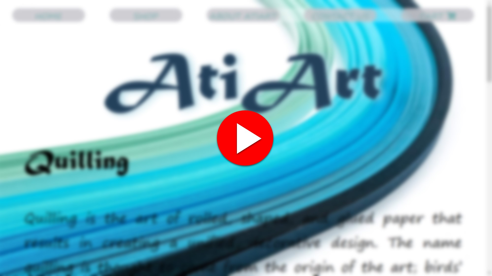</a>

  

<h3>and, This video shows the performance of the content management system:</h3>

   

# Home page

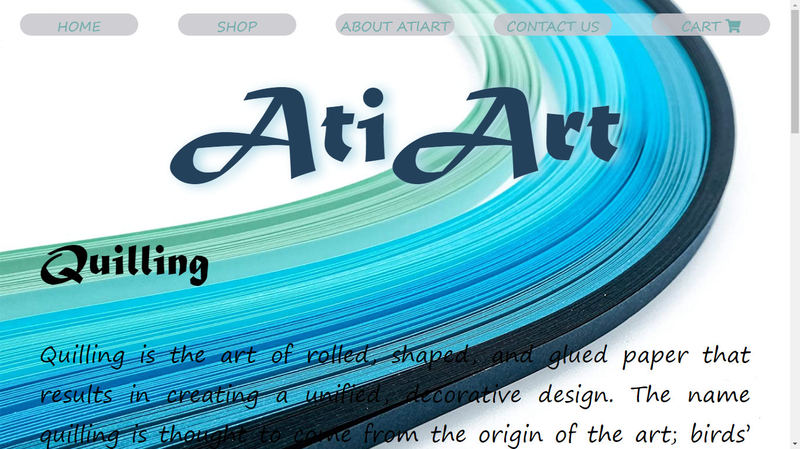

 

On home page you can access some description about quilling art and see some sample products.

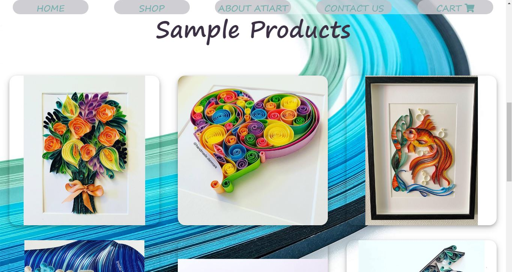

 

# Shop page

You can access shop page by shop button on menu. On shop page you access all active products
and you can see the price and add them to cart or click on product and go to sample page and see another sample images.

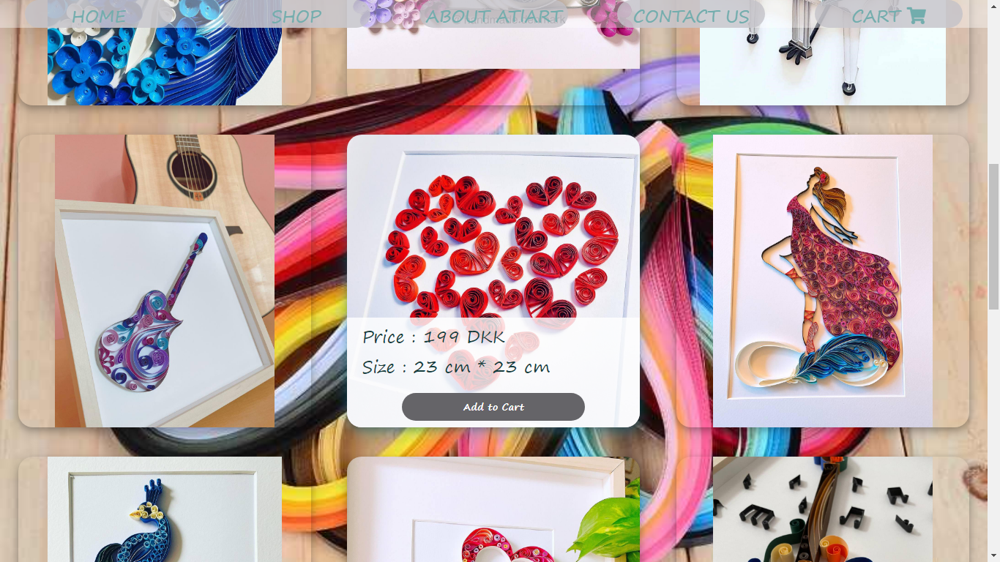

 

# Sample page

If you click on sample product on home page or shop page, you can see another sample images and add it to cart or return to shop page.

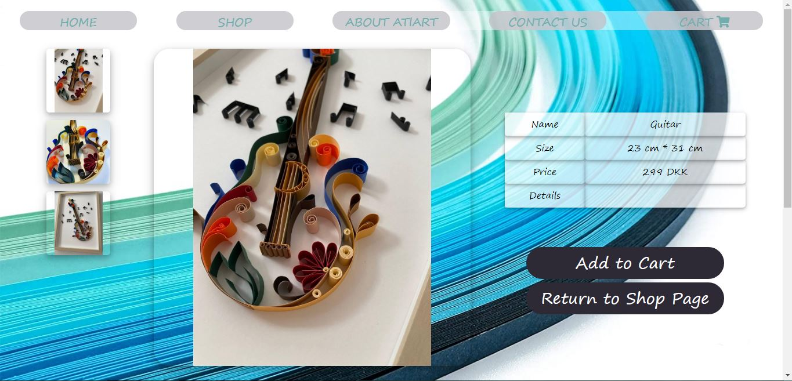

 

# Cart page
When you add product to cart, you can access to cart or continue shoping, furthermore, you can access cart page by top menu.

On cart page you can see added products and invoice. Furthermore, you can change the quantity, remove the added product, or see the product again by ckicking on it's image.

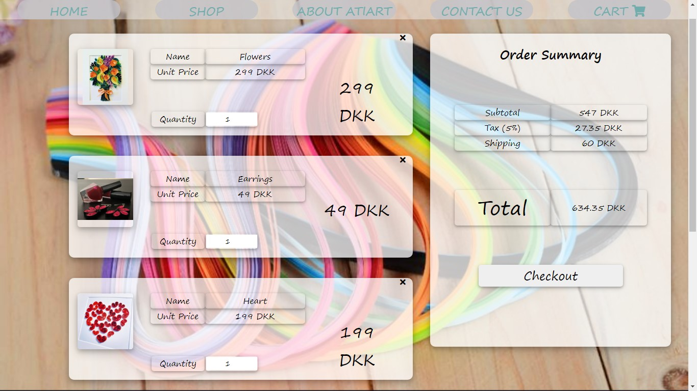

 

# Contact page

You can access contact page by 'contact us' button on menu. on contact page you can see contact information and you can leave a message to website admin.

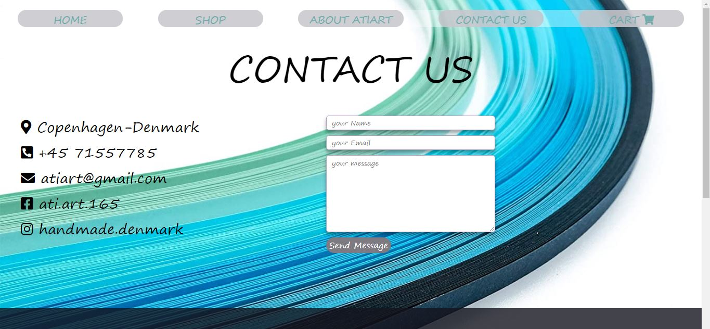

 

# Footer
You can access some information on the website footer.

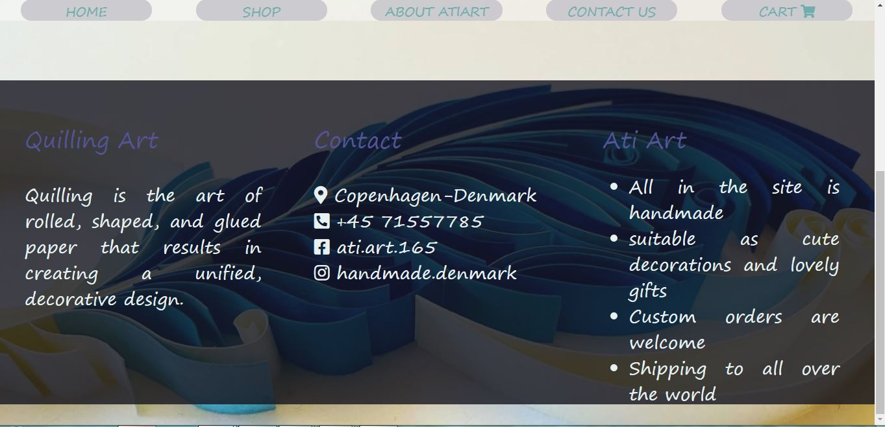

   

# Management part

`management.php` works like a single page app too, that includes 'manage messages' part and "manage products".

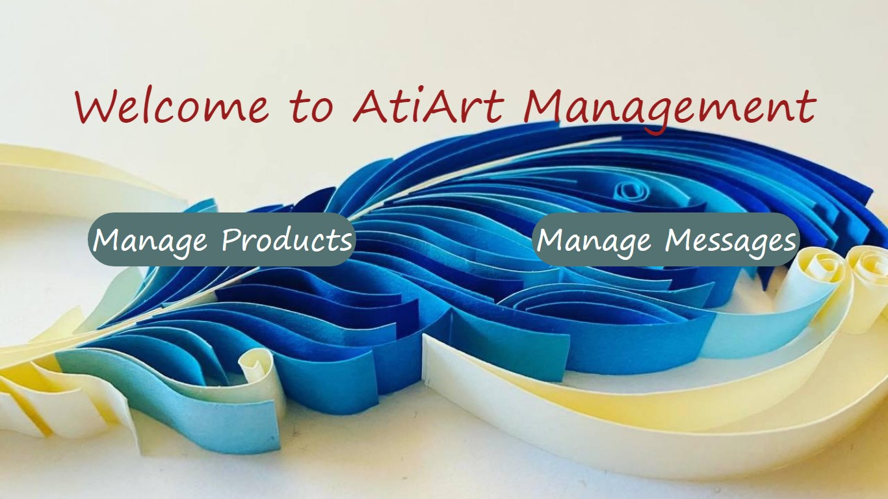

 

# Manage products

On "manage products" page, admin can see all active and deactive products list and them details, like name, size, price, details, sort and activation.

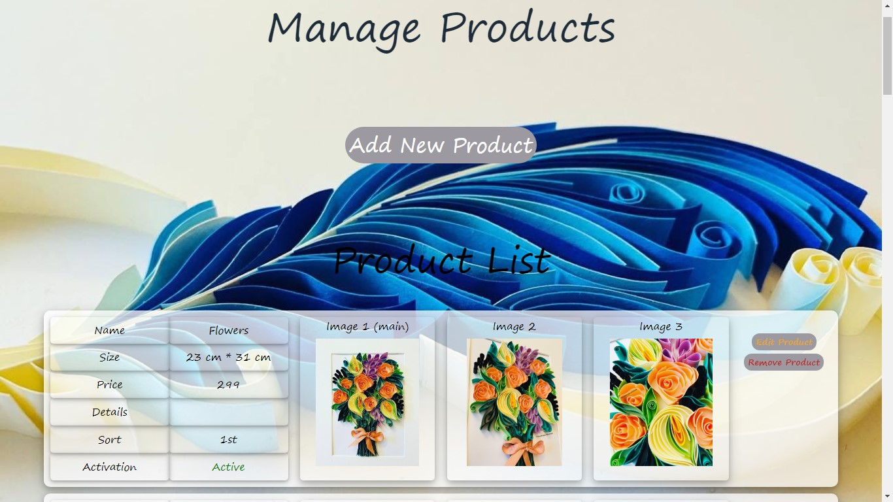

In addition, admin can add a new product by pushing "Add New Product" button, so a new box will open and He/She can set product items and chose 3 images for product and see image preview without refreshing. Images storage in temp directory, if admin pushes save button, images move to upload directory.

The Sort item sets due to the active products, so if admin chose "deactive" option for the product, it has no sort and will not show for user. 

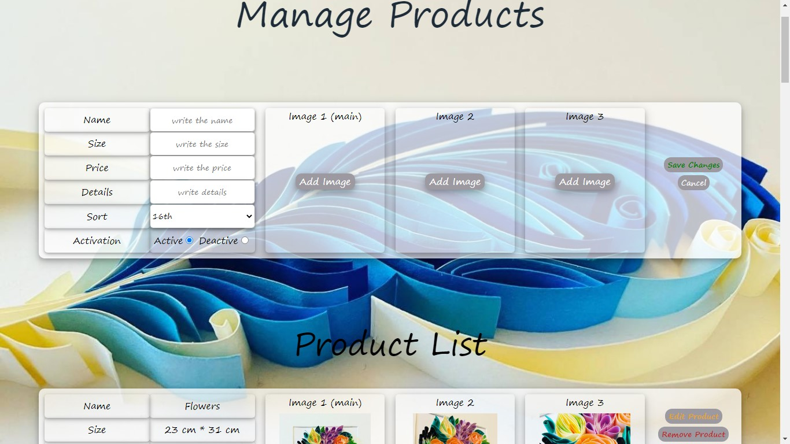

 

Admin can remove product by pushing "remove product" button (and confirmation), or edit it by pushing "edit product" button. Admin can edit name, size, price, details, sort, activation and change images (or add new image if there was not eny image) , or remove images.

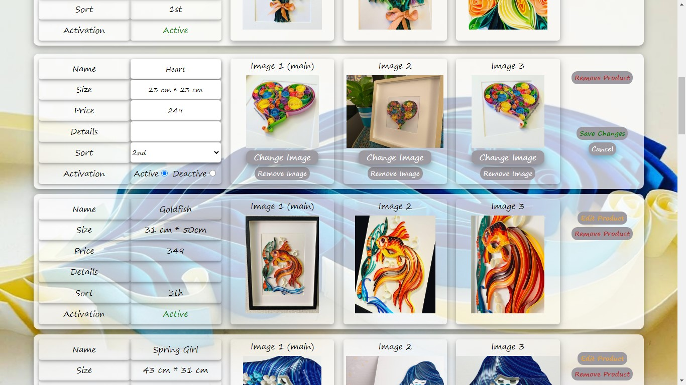

 

# Manage messages

When user leave a message on contact page, the mesage storages in database, and admin can see messages on " Manage messages" part.

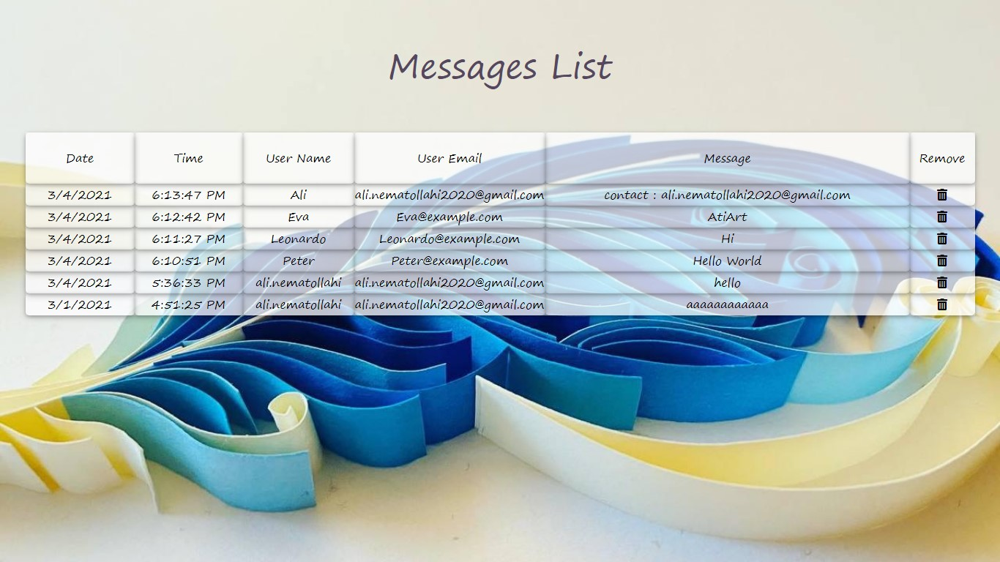

